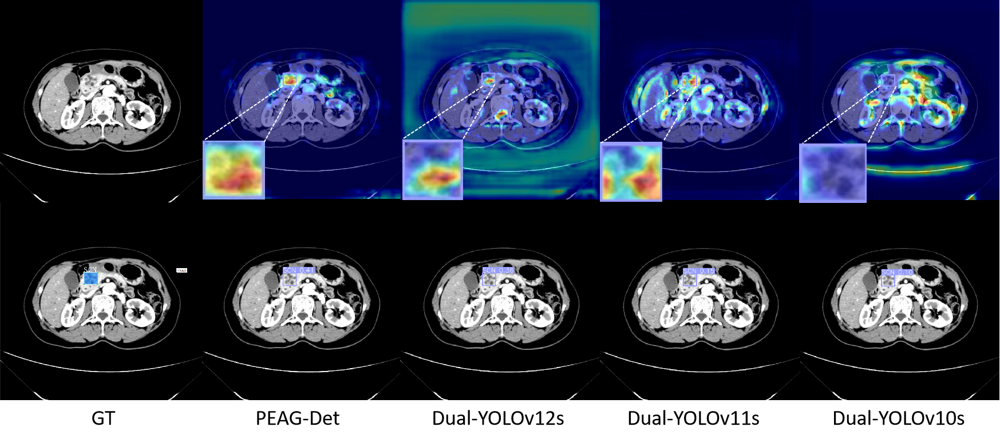
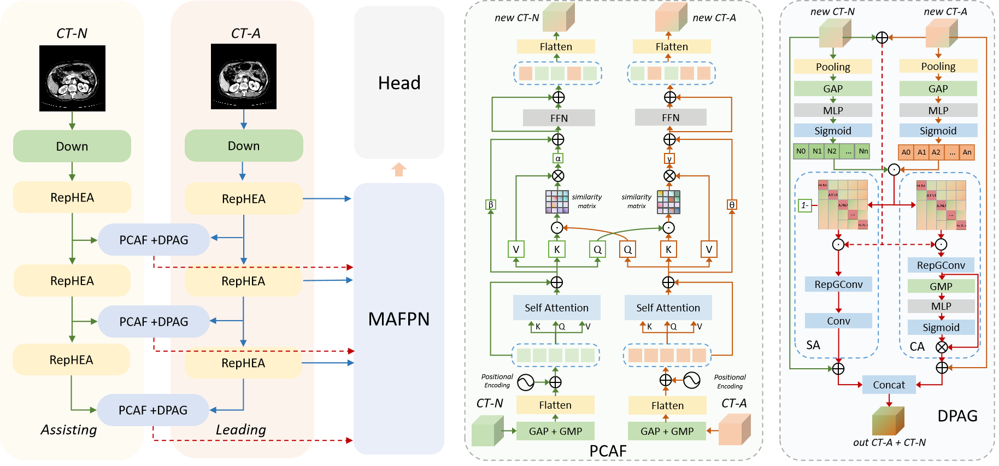

# PEAGDet


This is the official code for the paper: PEAG-Det: A Dual-Stream Phase- and Edge-Aware Framework with Adaptive Gating for Cross-Phase Tumor Detection
<div align="center">
 <a href="./">
     
</a>
 
</div>

## Train
Single GPU training
```python
# train.py
from ultralytics import YOLOv10

if __name__ == "__main__":
    model = YOLOv10("PEAG-Det.yaml")
    model.train(
        data="dual_yixian.yaml", epochs=300, batch=64, imgsz=640, device="0", workers=4, val_period=1, scale=0.9
    )
```
## Val
```python
# val.py
from ultralytics import YOLOv10

if __name__ == "__main__":
    model = YOLOv10("best.pt")
    model.val(data="dual_yixian.yaml", device=0, split="val", batch=8)
```
## Model Architecture
```python
# Parameters
ch: 6
nc: 5 # number of classes
scales: # model compound scaling constants, i.e. 'model=yolov8n.yaml' will call yolov8.yaml with scale 'n'
  # [depth, width, max_channels]
#  n: [0.33, 0.25, 1024]
  n: [0.33, 0.25, 1024]
# YOLOv8.0n backbone
backbone:
  # [from, repeats, module, args]
  - [-1, 1, Dual_in, [6]] # 0-P1/2
  - [-1, 1, Dual_out, [1]] # 0-P1/2
  - [-2, 1, Dual_out, [2]] # 0-P1/2

  - [1, 1, Conv, [64, 3, 2]] # 0-P1/2
  - [-1, 1, Conv, [128, 3, 2]] # 1-P2/4
  - [-1, 1, RepHEA, [128, 3, 1, 3, 3]]   # 5
  - [-1, 1, Conv, [256, 3, 2]] # 3-P3/8
  - [-1, 1, RepHEA, [256, 3, 1, 3, 5]]
  - [-1, 1, SCDown, [512, 3, 2]] # 5-P4/16
  - [-1, 1, RepHEA, [512, 3, 1, 3, 7]]
  - [-1, 1, SCDown, [768, 3, 2]] # 7-P5/32
  - [-1, 1, RepHEA, [768, 3, 1, 3, 9]]
  - [-1, 1, SPPF, [768, 5]] # 9
  - [-1, 1, PSA, [768]] # 13

  - [2, 1, Conv, [64, 3, 2]] # 0-P1/2
  - [-1, 1, Conv, [128, 3, 2]] # 1-P2/4
  - [-1, 1, RepHEA, [128, 3, 1, 3, 3]]  # 16
  - [-1, 1, Conv, [256, 3, 2]] # 3-P3/8
  - [-1, 1, RepHEA, [256, 3, 1, 3, 5]]
  - [-1, 1, SCDown, [512, 3, 2]] # 5-P4/16
  - [-1, 1, RepHEA, [512, 3, 1, 3, 7]]#     20
  - [-1, 1, SCDown, [768, 3, 2]] # 7-P5/32
  - [-1, 1, RepHEA, [768, 3, 1, 3, 9]]#     22
  - [-1, 1, SPPF, [768, 5]] # 9
  - [-1, 1, PSA, [768]] #     24

  - [ [ 5, 16 ], 1, Concat, [ 1 ] ]  # 16 - >25
  - [ [ 7, 18 ], 1, PCAF_DPAG, [ 48, 40, 40, 8, 3, 1 ] ]  #24 - >28   +13  + 17
  - [ [ 9, 20 ], 1, PCAF_DPAG, [ 96, 30, 30, 8, 3, 1 ] ]  #24 - >28   +13  + 17
  - [ [ 13, 24 ], 1, PCAF_DPAG, [ 192, 20, 20, 8, 3, 1 ] ]  #24 - >28   +13  + 17


# YOLOv8.0n head
head:
  - [27, 1, AVG, []]
  - [[-1, 28, 24], 1, Concat, [1]]
  - [-1, 1, RepHEA, [512, 3, 1, 3, 9]] #13

  - [-1, 1, nn.Upsample, [None, 2, "nearest"]]
  - [28, 1, nn.Upsample, [None, 2, "nearest"]]
  - [26, 1, AVG, []]
  - [[-1, 27, -2, -3, 20], 1, Concat, [1]]
  - [-1, 1, RepHEA, [384, 3, 1, 3, 7]] #18

  - [-1, 1, nn.Upsample, [None, 2, "nearest"]]
  - [27, 1, nn.Upsample, [None, 2, "nearest"]]
  - [25, 1, AVG, []]
  - [[-1, 26, -2, -3, 18], 1, Concat, [1]]
  - [-1, 1, RepHEA, [256, 3, 1, 3, 5]] #23

  - [36, 1, nn.Upsample, [None, 2, "nearest"]]
  - [[-1, -2], 1, Concat, [1]]
  - [-1, 1, RepHEA, [256, 3, 1, 3, 5]] # 26

  - [-1, 1, Conv, [384, 3, 2]]
  - [41, 1, AVG, []]
  - [31, 1, nn.Upsample, [None, 2, "nearest"]]
  - [[-2, -1, 36, -3], 1, Concat, [1]]
  - [-1, 1, RepHEA, [384, 3, 1, 3, 7]] # 31

  - [-1, 1, Conv, [384, 3, 2]]
  - [36, 1, AVG, []]
  - [[-2, -1, 31], 1, Concat, [1]]
  - [-1, 1, RepHEA, [512, 3, 1, 3, 9]] # 35

  - [[44, 49, 53], 1, Detect, [nc]] # Detect(P3, P4, P5)
```
## Model  Figures
<div align="center">
 <a href="./">
     

</a>
 
</div>
